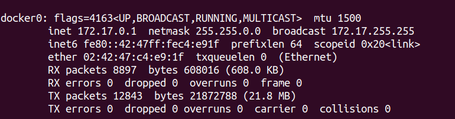
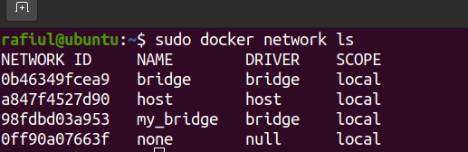

# Docker Network
Docker networking enables a user to link a Docker container to as many networks as he/she requires. Docker Networks are used to provide complete isolation for Docker containers.
A user can add containers to more than one network.

# Docker Container Network

 _The Docker networking allows you to attach a container as a many network as like you. You can attach already running containers._

# Docker Default Network(docker0)
When Docker is installed, a default bridge network named (docker0) is created.Each a new docker container automatically attached to this network, unless a custom network specific.
```
$ ifconfig
```

## Type of Docker Networking Drivers 
1.bridge
2.host
3.overly
4.macvlan
5.none
# Lunch a container on the default network 
_Every instalation of the Docker Engine automatically include three default networks_


1.bridge
2.host
3.none
```
$ sudo docker network ls
```



